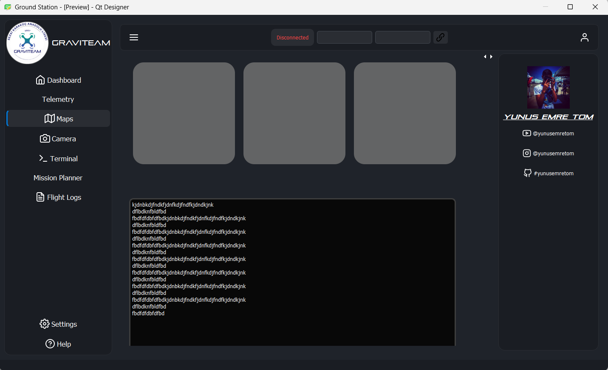

# 🚀 Modern Uçuş Simülasyonu Arayüzü

## 📋 Proje Hakkında
Bu proje, modern bir uçuş simülasyonu arayüzü sunan bir Python uygulamasıdır. PyQt5 kullanılarak geliştirilmiş olup, gerçek zamanlı uçuş göstergeleri ve kamera görüntüsü entegrasyonu içermektedir.



## ✨ Özellikler
- 🎮 Gerçek zamanlı uçuş göstergeleri
- 📹 Kamera görüntüsü entegrasyonu
- 🎨 Modern ve kullanıcı dostu arayüz
- 🛠️ Özelleştirilebilir ayarlar
- 📊 Uçuş verilerinin görselleştirilmesi

## 🛠️ Teknolojiler
- Python 3.10
- PyQt5
- OpenCV
- NumPy

## 📁 Proje Yapısı
```
├── main.py              # Ana uygulama dosyası
├── sidebar.py           # Yan menü arayüzü
├── sidebar.ui           # Yan menü tasarımı
├── splash.py            # Açılış ekranı
├── threadGUI.py         # Thread yönetimi
├── camera/              # Kamera ile ilgili modüller
├── icons/               # Uygulama ikonları
├── qfi/                 # Uçuş göstergeleri modülleri
└── logs/                # Log dosyaları
```

## 🚀 Kurulum
1. Gerekli Python paketlerini yükleyin:
```bash
pip install -r requirements.txt
```

2. Uygulamayı çalıştırın:
```bash
python main.py
```

## 🤝 Katkıda Bulunma
1. Bu depoyu fork edin
2. Yeni bir branch oluşturun (`git checkout -b feature/amazing-feature`)
3. Değişikliklerinizi commit edin (`git commit -m 'Add some amazing feature'`)
4. Branch'inizi push edin (`git push origin feature/amazing-feature`)
5. Pull Request oluşturun

## 📝 Lisans
Bu proje MIT lisansı altında lisanslanmıştır. Daha fazla bilgi için `LICENSE` dosyasına bakın.

## 📧 İletişim
Proje Sahibi - [@your-username](https://github.com/your-username)

Proje Linki: [https://github.com/your-username/modern-gui](https://github.com/your-username/modern-gui)
